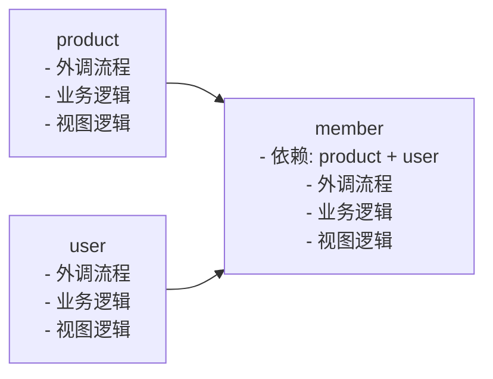

# biz_process

`biz_process` 提供了一个可扩展的业务流程 FSM 框架。

该目录本身是一个独立的 Go module。

## 核心类型

- `State` / `Event`：基于字符串的状态机标识。
- `Transition`：从 `From + Event` 到 `To` 的迁移规则。
- `Guard`：可选前置校验函数。
- `Node`：统一的轻量节点抽象。
- `Action`：FSM 中用于执行迁移动作的节点类型。
- `Extension`：迁移生命周期扩展钩子。

```go
type Transition struct {
    From   State
    Event  Event
    To     State
    Guard  Guard
    Action Action
}
```

## 扩展钩子

```go
type Extension interface {
    BeforeTransition(ctx context.Context, from State, to State, event Event, payload any) error
    AfterTransition(ctx context.Context, from State, to State, event Event, payload any)
    OnTransitionError(ctx context.Context, from State, to State, event Event, payload any, err error)
}
```

默认空实现可使用 `NoopExtension`。

## 行为说明

- `FSM` 线程安全。
- 迁移键由 `from + event` 组成。
- `Fire` 执行顺序：
1. 匹配迁移规则
2. 执行 `BeforeTransition`
3. 执行 `Guard`
4. 执行 `Action`
5. 更新状态
6. 执行 `AfterTransition`
- 在状态更新前任一步出错，状态都保持不变。
- `OnTransitionError` 会在规则缺失、钩子失败、Guard 拒绝、Action 失败时触发。


## BPMN-like 流程编排

`bpmn.go` 提供了一个轻量流程编排器，抽象为 `Process -> ProcessLayer -> Task`。

- `Process.Layers` 按串行顺序执行
- `ProcessLayer.Nodes` 在同一层内并行执行 `Task`
- `Task` 同时实现了 `Node` 和 `ProcessNode`

```go
process := biz_process.Process{
    Name: "order-flow",
    Layers: []biz_process.ProcessLayer{
        {
            Name: "prepare",
            Nodes: []biz_process.ProcessNode{
                biz_process.Task{Name: "prepare", Task: func(ctx context.Context) error { return nil }},
            },
        },
        {
            Name: "fanout",
            Nodes: []biz_process.ProcessNode{
                biz_process.Task{Name: "audit", Task: func(ctx context.Context) error { return nil }},
                biz_process.Task{Name: "notify", Task: func(ctx context.Context) error { return nil }},
            },
        },
        {
            Name: "finalize",
            Nodes: []biz_process.ProcessNode{
                biz_process.Task{Name: "finalize", Task: func(ctx context.Context) error { return nil }},
            },
        },
    },
}

if err := biz_process.RunProcess(context.Background(), process); err != nil {
    panic(err)
}
```

## DAG 流程编排

`dag.go` 提供了基于依赖关系的 DAG 编排能力。

- 节点按依赖顺序执行
- 同一拓扑层级会并行执行
- 内置环检测与非法依赖校验
- `GraphNode` 实现了 `Node`

典型场景是把可并行的外调、业务逻辑、视图逻辑拆到独立节点，在依赖满足后立刻往下推进，而不是串行阻塞整个请求。



在这个 DAG 中：

- `product` 和 `user` 可以先并行发起外调、执行业务计算、生成视图 Chunk
- `member` 只在 `product` 和 `user` 的依赖结果就绪后再启动
- 当 `member` 仍在外调时，`product` 和 `user` 的视图渲染可以继续推进
- 如果接入流式输出，`product` 和 `user` 的 Chunk 甚至可以先返回到端上并开始客户端渲染，从而压缩整体链路耗时

```go
dag := []biz_process.GraphNode{
    {Name: "prepare", Task: func(ctx context.Context) error { return nil }},
    {Name: "audit", DependsOn: []string{"prepare"}, Task: func(ctx context.Context) error { return nil }},
    {Name: "notify", DependsOn: []string{"prepare"}, Task: func(ctx context.Context) error { return nil }},
    {Name: "finalize", DependsOn: []string{"audit", "notify"}, Task: func(ctx context.Context) error { return nil }},
}

if err := biz_process.RunDAG(context.Background(), dag); err != nil {
    panic(err)
}
```

## 示例

```go
package main

import (
    "context"
    "fmt"

    "github.com/daidai21/biz_ext_framework/biz_process"
)

func main() {
    fsm, err := biz_process.NewFSM("CREATED", []biz_process.Transition{
        {From: "CREATED", Event: "PAY", To: "PAID"},
        {From: "PAID", Event: "SHIP", To: "SHIPPED"},
    })
    if err != nil {
        panic(err)
    }

    state, err := fsm.Fire(context.Background(), "PAY", nil)
    if err != nil {
        panic(err)
    }
    fmt.Println(state)
}
```

## 示例：BPMN + Rerun + Call Cache

下面这个例子串起了一个常见外调模式：

- 用 `RunProcess` 跑业务流程
- 用 `Rerunner.Execute` 包住不稳定下游
- 在请求入口用 `WithCallCache(ctx)`，让同一个请求在成功后复用外调结果

```go
package main

import (
    "context"
    "errors"
    "fmt"

    "github.com/daidai21/biz_ext_framework/biz_process"
)

type profileReq struct {
    UserID string `json:"user_id"`
}

func main() {
    ctx := biz_process.WithCallCache(context.Background())

    var remoteCalls int
    fetchProfile := func(ctx context.Context, req profileReq) (string, error) {
        return biz_process.CallWithCache(ctx, req, func(context.Context, profileReq) (string, error) {
            remoteCalls++
            if remoteCalls == 1 {
                return "", errors.New("temporary upstream failure")
            }
            return "profile-u1001", nil
        })
    }

    rerunner := biz_process.Rerunner[profileReq, string]{Attempts: 2}

    var prepareProfile string
    var finalizeProfile string

    process := biz_process.Process{
        Name: "order-flow",
        Layers: []biz_process.ProcessLayer{
            {
                Name: "prepare",
                Nodes: []biz_process.ProcessNode{
                    biz_process.Task{
                        Name: "load-profile",
                        Task: func(ctx context.Context) error {
                            value, err := rerunner.Execute(ctx, profileReq{UserID: "u1001"}, fetchProfile)
                            if err != nil {
                                return err
                            }
                            prepareProfile = value
                            return nil
                        },
                    },
                },
            },
            {
                Name: "finalize",
                Nodes: []biz_process.ProcessNode{
                    biz_process.Task{
                        Name: "reuse-profile",
                        Task: func(ctx context.Context) error {
                            value, err := rerunner.Execute(ctx, profileReq{UserID: "u1001"}, fetchProfile)
                            if err != nil {
                                return err
                            }
                            finalizeProfile = value
                            return nil
                        },
                    },
                },
            },
        },
    }

    if err := biz_process.RunProcess(ctx, process); err != nil {
        panic(err)
    }

    fmt.Println(prepareProfile)
    fmt.Println(finalizeProfile)
    fmt.Println(remoteCalls)
    // profile-u1001
    // profile-u1001
    // 2
}
```
